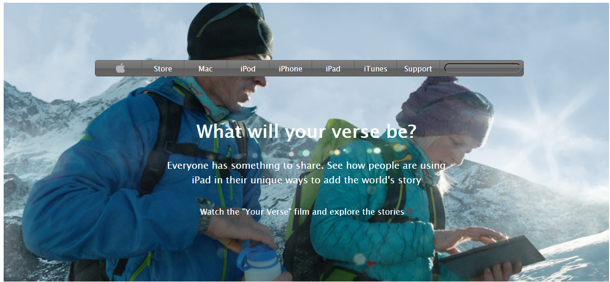

# Apple-website-webpage-Clone

> This project is a responsive Apple Home page.

Additional description about the project and its features.

## Built With

- HTML
- CSS
- Flexbox
- Grid

## Live Demo

[Live Demo Link](https://pastorp3.github.io/)

## Authors

👤 **José Pedraza**

- Github: [@pastorp3](https://github.com/pastorp3)
- Twitter: [@jose_pastorp3](https://twitter.com/jose_pastorp3)
- Linkedin: [linkedin](https://www.linkedin.com/in/jos%C3%A9-pedraza-acevedo-ab700a1a9/)

👤 **Bbosa Muhamood**

- Github: [@bmuhamood](https://github.com/bmuhamood)
- Twitter: [@croixtechfirm](https://twitter.com/croixtechfirm)
- Linkedin: [linkedin](https://www.linkedin.com/in/bbosa-muhamood-06845576/)

## 🤝 Contributing

Contributions, issues and feature requests are welcome!

Feel free to check the [issues page](https://github.com/bmuhamood/Apple-website-webpage-Clone/issues).

## Show your support

Give a ⭐️ if you like this project!

## 📝 License

This project is [MIT](lic.url) licensed.
